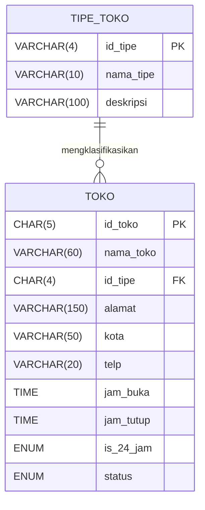
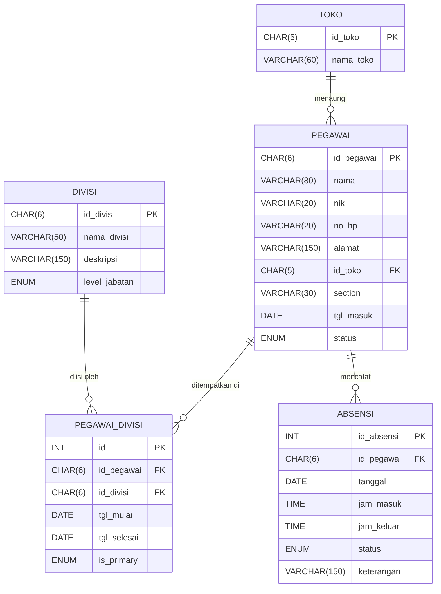
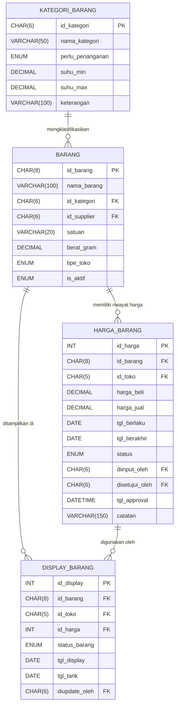
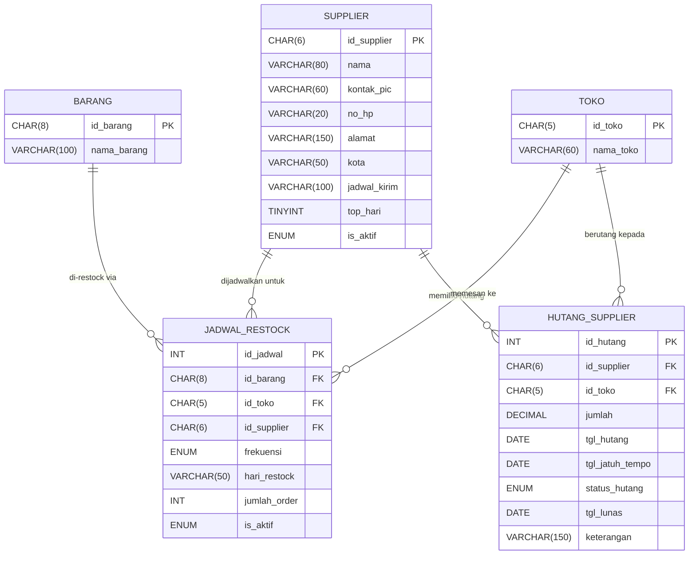
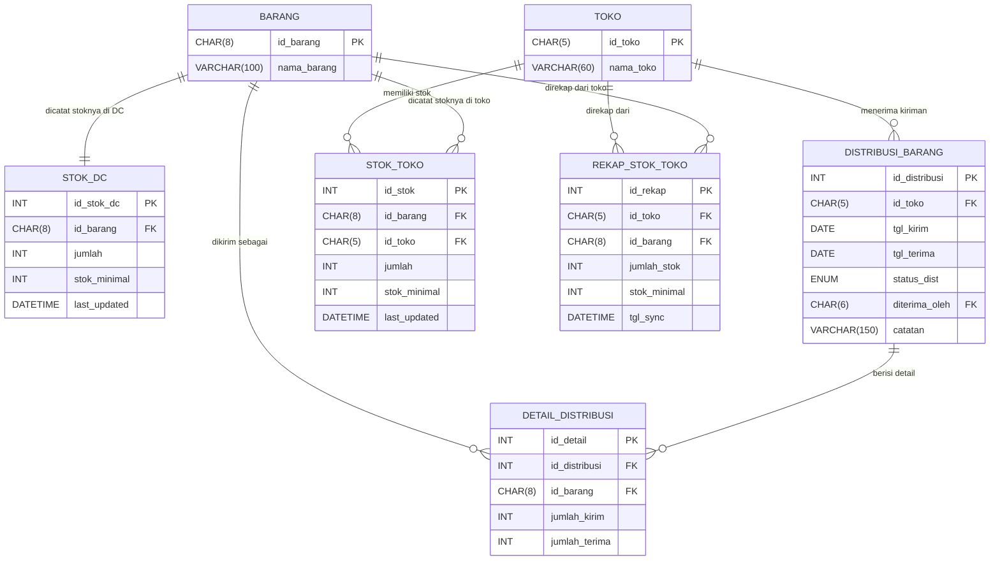
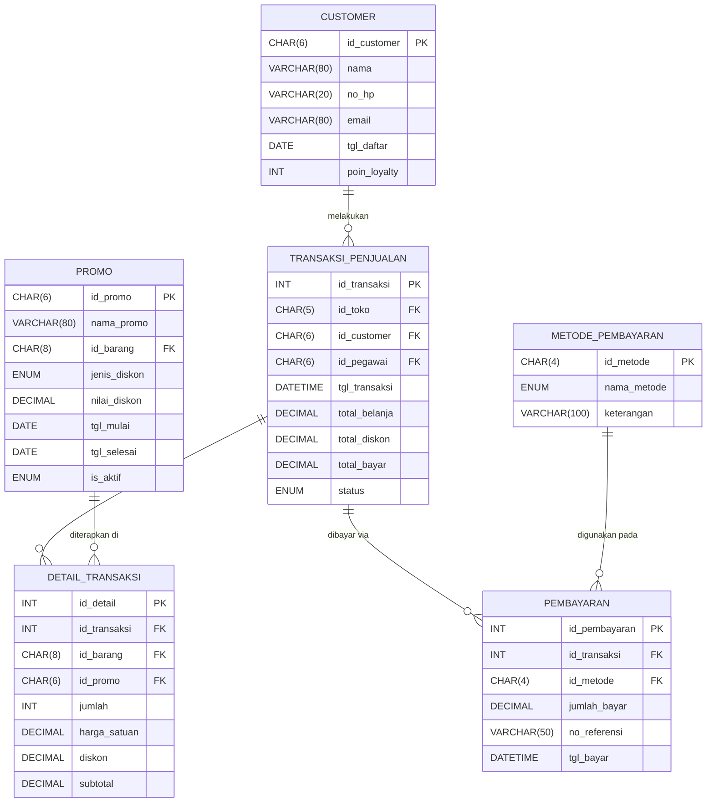

# ERD Database — Final Project Basis Data
> Sistem Multi-Database: GUDANG · EXPRESS · toko_reguler

---

## Panduan Membaca ERD

- **||--o{** = One-to-Many (Satu ke Banyak)
- **||--||** = One-to-One (Satu ke Satu)
- **}o--o{** = Many-to-Many (Banyak ke Banyak)
- **PK** = Primary Key
- **FK** = Foreign Key

---

## Domain 1 — Organisasi & Lokasi (Store Management)

> Mencakup tabel: `tipe_toko`, `toko`
> Sumber: **GUDANG.sql**



---

## Domain 2 — Kepegawaian (HR & Personalia)

> Mencakup tabel: `divisi`, `pegawai`, `pegawai_divisi`, `absensi`
> Sumber: **GUDANG.sql**, **TokoExpress.sql**, **TokoReguler.sql**



---

## Domain 3 — Master Barang & Harga (Product Catalog & Pricing)

> Mencakup tabel: `kategori_barang`, `barang`, `harga_barang`, `display_barang`
> Sumber: **GUDANG.sql**, **TokoExpress.sql**, **TokoReguler.sql**



---

## Domain 4 — Pemasok & Pembelian (Supplier & Procurement)

> Mencakup tabel: `supplier`, `jadwal_restock`, `hutang_supplier`
> Sumber: **GUDANG.sql**, **TokoExpress.sql**, **TokoReguler.sql**



---

## Domain 5 — Inventori & Distribusi (Inventory & Logistics)

> Mencakup tabel: `stok_dc`, `stok_toko`, `rekap_stok_toko`, `distribusi_barang`, `detail_distribusi`
> Sumber: **GUDANG.sql**, **TokoExpress.sql**, **TokoReguler.sql**



---

## Domain 6 — Penjualan & Pelanggan (Point of Sales / POS)

> Mencakup tabel: `customer`, `promo`, `metode_pembayaran`, `transaksi_penjualan`, `detail_transaksi`, `pembayaran`
> Sumber: **TokoExpress.sql**, **TokoReguler.sql**



---

## ERD Enterprise — Gabungan Seluruh Domain

> Diagram ini menggabungkan seluruh entitas utama antar 6 domain dan memperlihatkan relasi lintas domain.

```mermaid
erDiagram
    %% ── DOMAIN 1: ORGANISASI ──
    TIPE_TOKO   { VARCHAR id_tipe PK }
    TOKO        { CHAR id_toko PK  ; CHAR id_tipe FK }

    %% ── DOMAIN 2: KEPEGAWAIAN ──
    DIVISI         { CHAR id_divisi PK }
    PEGAWAI        { CHAR id_pegawai PK ; CHAR id_toko FK }
    PEGAWAI_DIVISI { INT id PK ; CHAR id_pegawai FK ; CHAR id_divisi FK }
    ABSENSI        { INT id_absensi PK  ; CHAR id_pegawai FK }

    %% ── DOMAIN 3: BARANG & HARGA ──
    KATEGORI_BARANG { CHAR id_kategori PK }
    BARANG          { CHAR id_barang PK ; CHAR id_kategori FK ; CHAR id_supplier FK }
    HARGA_BARANG    { INT id_harga PK   ; CHAR id_barang FK  ; CHAR id_toko FK }
    DISPLAY_BARANG  { INT id_display PK ; CHAR id_barang FK  ; INT id_harga FK }

    %% ── DOMAIN 4: SUPPLIER ──
    SUPPLIER        { CHAR id_supplier PK }
    JADWAL_RESTOCK  { INT id_jadwal PK ; CHAR id_barang FK ; CHAR id_toko FK ; CHAR id_supplier FK }
    HUTANG_SUPPLIER { INT id_hutang PK ; CHAR id_supplier FK ; CHAR id_toko FK }

    %% ── DOMAIN 5: INVENTORI ──
    STOK_DC           { INT id_stok_dc PK ; CHAR id_barang FK }
    STOK_TOKO         { INT id_stok PK    ; CHAR id_barang FK ; CHAR id_toko FK }
    REKAP_STOK_TOKO   { INT id_rekap PK   ; CHAR id_toko FK   ; CHAR id_barang FK }
    DISTRIBUSI_BARANG { INT id_distribusi PK ; CHAR id_toko FK }
    DETAIL_DISTRIBUSI { INT id_detail PK  ; INT id_distribusi FK ; CHAR id_barang FK }

    %% ── DOMAIN 6: POS ──
    CUSTOMER            { CHAR id_customer PK }
    PROMO               { CHAR id_promo PK    ; CHAR id_barang FK }
    METODE_PEMBAYARAN   { CHAR id_metode PK }
    TRANSAKSI_PENJUALAN { INT id_transaksi PK ; CHAR id_toko FK ; CHAR id_customer FK ; CHAR id_pegawai FK }
    DETAIL_TRANSAKSI    { INT id_detail PK    ; INT id_transaksi FK ; CHAR id_barang FK ; CHAR id_promo FK }
    PEMBAYARAN          { INT id_pembayaran PK; INT id_transaksi FK ; CHAR id_metode FK }

    %% ─── RELASI DOMAIN 1 ───
    TIPE_TOKO ||--o{ TOKO : "tipe"

    %% ─── RELASI DOMAIN 2 ───
    TOKO       ||--o{ PEGAWAI        : "menaungi"
    PEGAWAI    ||--o{ PEGAWAI_DIVISI : "ditempatkan"
    DIVISI     ||--o{ PEGAWAI_DIVISI : "diisi"
    PEGAWAI    ||--o{ ABSENSI        : "hadir"

    %% ─── RELASI DOMAIN 3 ───
    KATEGORI_BARANG ||--o{ BARANG         : "kategori"
    BARANG          ||--o{ HARGA_BARANG   : "harga"
    BARANG          ||--o{ DISPLAY_BARANG : "display"
    HARGA_BARANG    ||--o{ DISPLAY_BARANG : "referensi"

    %% ─── RELASI DOMAIN 4 ───
    SUPPLIER ||--o{ JADWAL_RESTOCK  : "jadwal"
    SUPPLIER ||--o{ HUTANG_SUPPLIER : "hutang"
    TOKO     ||--o{ JADWAL_RESTOCK  : "order"
    TOKO     ||--o{ HUTANG_SUPPLIER : "bayar"

    %% ─── RELASI DOMAIN 5 ───
    BARANG            ||--||  STOK_DC           : "stok DC"
    BARANG            ||--o{  STOK_TOKO         : "stok toko"
    TOKO              ||--o{  DISTRIBUSI_BARANG : "kirim ke"
    DISTRIBUSI_BARANG ||--o{  DETAIL_DISTRIBUSI : "detail"
    TOKO              ||--o{  REKAP_STOK_TOKO   : "rekap"

    %% ─── RELASI DOMAIN 6 ───
    CUSTOMER            ||--o{ TRANSAKSI_PENJUALAN : "transaksi"
    TRANSAKSI_PENJUALAN ||--o{ DETAIL_TRANSAKSI    : "item"
    TRANSAKSI_PENJUALAN ||--o{ PEMBAYARAN          : "bayar"
    METODE_PEMBAYARAN   ||--o{ PEMBAYARAN          : "metode"
    PROMO               ||--o{ DETAIL_TRANSAKSI    : "promo"

    %% ─── RELASI LINTAS DOMAIN (Cross-Domain) ───
    BARANG   ||--o{ JADWAL_RESTOCK  : "D3→D4: restock"
    BARANG   ||--o{ DETAIL_DISTRIBUSI : "D3→D5: distribusi"
    BARANG   ||--o{ STOK_DC         : "D3→D5: stok DC"
    BARANG   ||--o{ STOK_TOKO       : "D3→D5: stok toko"
    BARANG   ||--o{ PROMO           : "D3→D6: promo"
    BARANG   ||--o{ DETAIL_TRANSAKSI: "D3→D6: dijual"
    SUPPLIER ||--o{ BARANG          : "D4→D3: pasok"
    TOKO     ||--o{ HARGA_BARANG    : "D1→D3: harga"
    TOKO     ||--o{ STOK_TOKO       : "D1→D5: stok"
    PEGAWAI  ||--o{ TRANSAKSI_PENJUALAN : "D2→D6: kasir"
    PEGAWAI  ||--o{ HARGA_BARANG    : "D2→D3: approval"
```

---

## Catatan Relasi Lintas Domain

| Dari Domain | Ke Domain | Tabel Penghubung | Keterangan |
|---|---|---|---|
| D3 Barang | D4 Supplier | `barang.id_supplier` | Setiap barang punya satu supplier utama |
| D4 Supplier | D5 Distribusi | `jadwal_restock` | Supplier mengisi jadwal restock ke toko |
| D3 Barang | D5 Inventori | `stok_dc`, `stok_toko`, `detail_distribusi` | Barang dilacak di DC dan masing-masing toko |
| D3 Barang | D6 POS | `detail_transaksi`, `promo` | Barang yang dijual & dipromosikan |
| D1 Toko | D3 Harga | `harga_barang.id_toko` | Harga barang per toko berbeda |
| D1 Toko | D5 Inventori | `distribusi_barang`, `stok_toko` | Toko menjadi tujuan distribusi & penyimpan stok |
| D2 Pegawai | D6 POS | `transaksi_penjualan.id_pegawai` | Pegawai (kasir) yang melayani transaksi |
| D2 Pegawai | D3 Harga | `harga_barang.diinput_oleh`, `disetujui_oleh` | Pegawai DC input & approval harga |
| D1 Toko | D2 Pegawai | `pegawai.id_toko` | Pegawai bertugas di toko tertentu |

---

*Dibuat untuk: Final Project Basis Data — Sistem Manajemen Ritel Multi-Database*
*Database: GUDANG · EXPRESS · toko_reguler*
